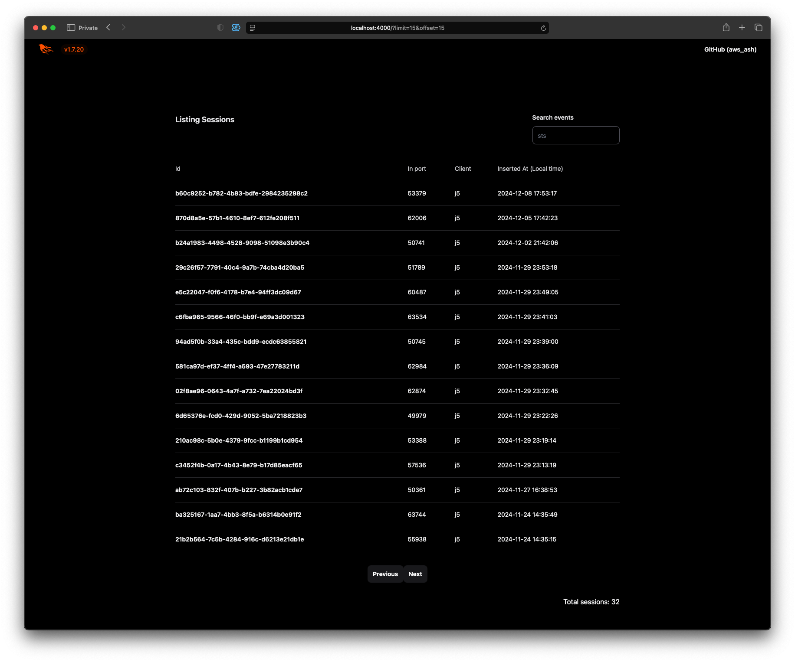
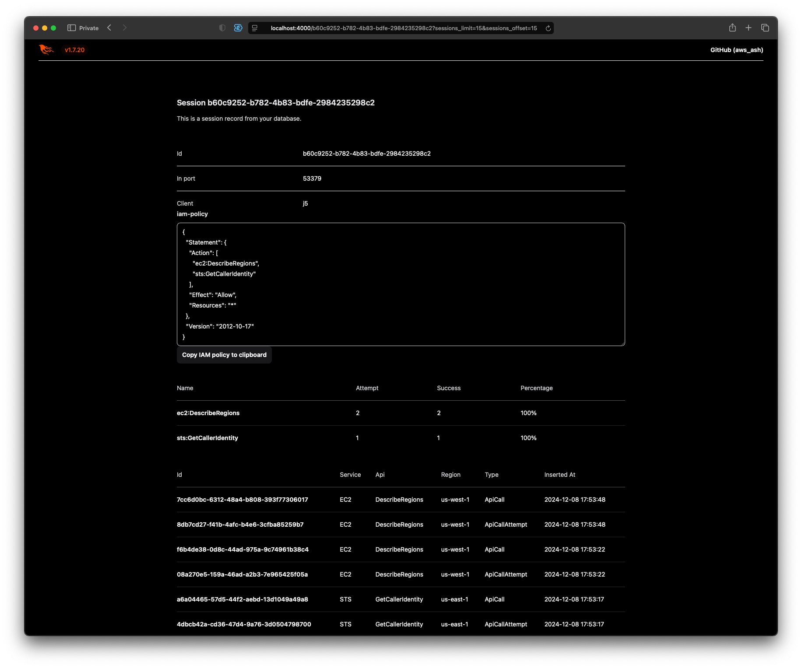

# AwsAsh

This application collects AWS SDK metrics. Each session captures all the events generated during that session.

Key features include:

- Generating an IAM Policy (copy to clipboard) for a specific session.
- Aggregating statistics for API call attempts and successful API calls.
- Search and filtering capabilities.
- Real-time updates for sessions and events.
- SQLite database (default path `~/.aws_ash/aws_ash.db`, can overwrite with `DATABASE_PATH`) for in-depth analysis.




## Enable AWS SDK Metrics

To enable AWS SDK metrics, simply set the `csm_enabled` or `AWS_CSM_ENABLED` flag to `true`.

* ~/.aws/config
```
[profile j5]
region = us-east-2
csm_enabled = true
csm_clientid = j5
```

Environment Variables:
```
AWS_CSM_ENABLED=true
AWS_CSM_PORT=31000
```

## macOS and Linux - devbox

If a release or package isn’t available for download, [devbox files](https://www.jetify.com/devbox) are available to quickly get up and running.

## Build Packages

1. `devbox shell`
1. `mix deps.get`
1. `mix desktop.installer`

## Run the Elixir, Phoenix app locally

To start your Phoenix server:

1. `devbox shell`
1. `mix deps.get`
1. Run `mix ash.migrate` to install and setup dependencies
1. Start Phoenix endpoint with `mix phx.server` or inside IEx with `iex -S mix phx.server`

Now you can visit [`localhost:4000`](http://localhost:4000) from your browser.

## Learn more

- AWS SDK Metrics: https://boto3.amazonaws.com/v1/documentation/api/1.17.109/guide/sdk-metrics.html (Old API docs)

## TODO

- Create a macOS DMG file and a Linux package that includes all dynamically linked libraries.
- Provide application statistics, including the total number of API calls, the number of sessions, events, and the timeframe of data.
